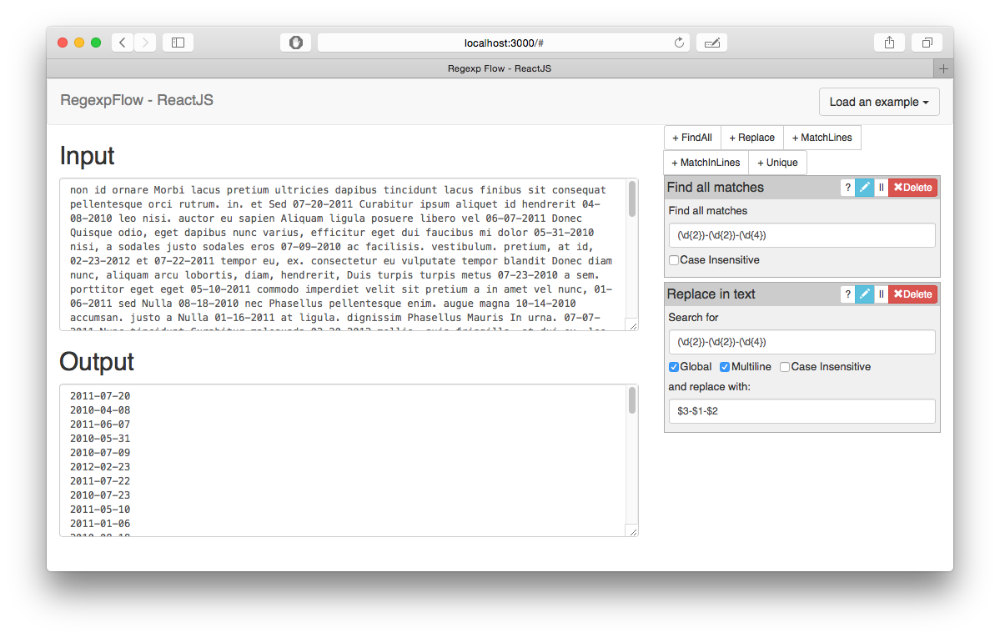

# RegexpFlow - ReactJS edition

## Description

Tool for processing small texts amounts with regular expressions.

You can grep text, grep only matches in a line, replace text using regular expressions, etc.

# Installation

This project was bootstrapped with [Create React App](https://github.com/facebookincubator/create-react-app).

## To install project:

```
$ git clone git@github.com:drbonzo/regexp_flow_react.git
$ cd regexp_flow_react
$ npm install
```

## To run project

```
npm start
```

## To build production build

```
npm run build
```

# Screenshots 


